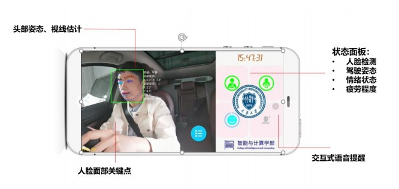
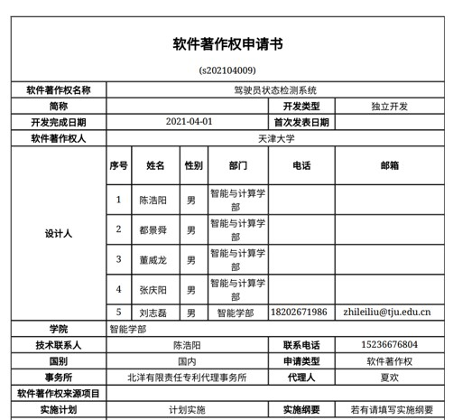
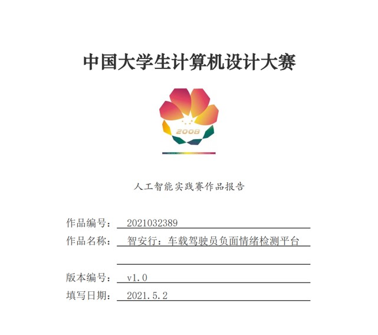

# 智安行:基于车载视觉系统的驾驶员负面情绪检测

问卷链接：https://www.wjx.cn/vm/mfWCDX5.aspx

## 项目背景

​	本仓库是天津大学智能与计算学部2018级本科生开发的车载APP智安行的展示主页，基于申报大创年会展示的需要而创立，方便大家下载并测试软件，以及填写问卷调查进行反馈。

<table>
    <tr>
        <td>

</td>
        <td>

</td>
    </tr>
</table>

​	日常交通驾驶情景中，分心驾驶、疲劳驾驶、负面情绪驾驶(焦虑、愤怒、紧张等)是引发交通事故的重要因素之一。以往的驾驶员监控系统（DMS，Driver Monitor System）重点关注于疲劳驾驶和分心驾驶的检测，而对负面情绪驾驶缺少关注。随着智能驾驶技术的发展，驾驶员负面情绪智能检测平台可以通过车载视觉系统对驾驶员的面部和肢体等视觉信息数据进行捕获，并通过深度学习等机器学习算法对驾驶员情绪进行识别，从而对可能造成危险情况的驾驶员情绪状态进行预警。

## 软件特色

​	我们建立了一套基于车载视觉系统驾驶员负面情绪检测平台，利用计算机视觉算法对可能威胁驾驶安全的分心驾驶、疲劳驾驶、负面情绪驾驶进行检测和预警。该系统可以实现**基于头部姿态估计的分心检测、基于眼部动作的疲劳检测和基于深度学习算法的情绪检测。**

- [x] 分心检测、疲劳检测、情绪检测
- [x] 安卓平台搭建，无需额外设备
- [x] 速度快、准确率高，适合夜间驾驶
- [x] 内置多条交互式语音消息进行提醒

## 软件应用成果

​	功能介绍面板如下。

------

​	实际测试效果如下。

<table>
    <tr>
        <td>

</td>
        <td>

</td>
    </tr>
</table>

​											&emsp;		正常驾驶																										疲劳驾驶

<table>
    <tr>
        <td>

</td>
        <td>

</td>
    </tr>
</table>

​												日间分心驾驶																						     日间愤怒驾驶

<table>
    <tr>
        <td>

</td>
        <td>

</td>
    </tr>
</table>

​													夜间分心驾驶																						夜间愤怒驾驶

​	该软件已申请软件著作权，并获得中国大学生计算机设计大赛市级一等奖。

<table>
    <tr>
        <td>

</td>
        <td>

</td>
    </tr>
</table>

